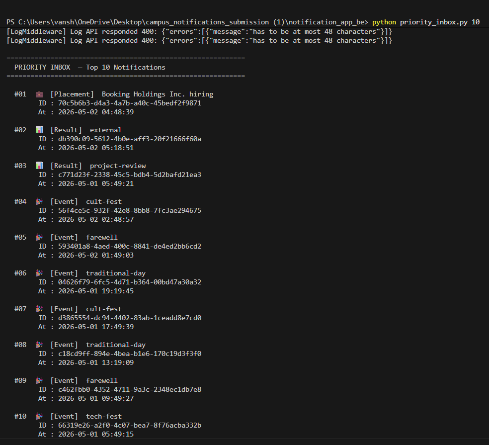
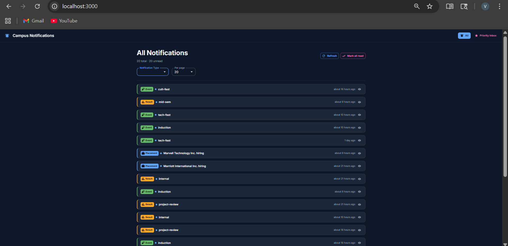
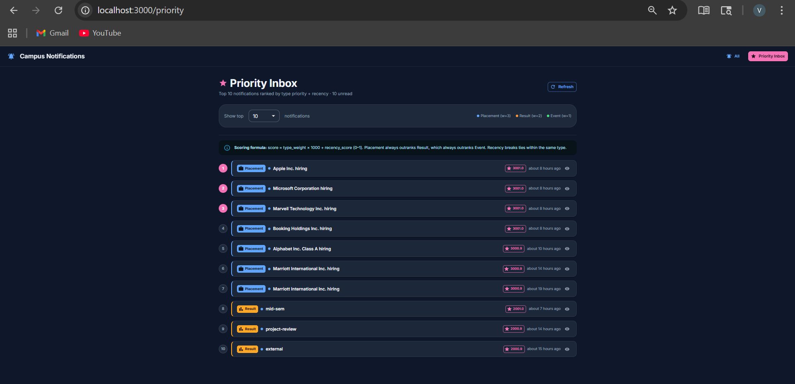
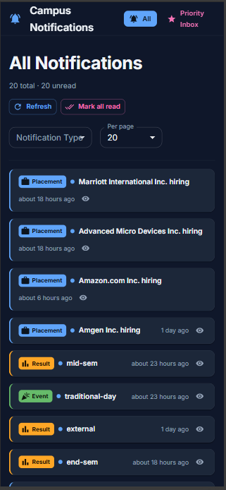

# Campus Notifications Platform

A full-stack campus notification platform where students receive real-time updates regarding Placements, Events, and Results. Built with a priority inbox algorithm, reusable logging middleware, and a responsive React/Next.js frontend.

---

## Project Structure

```
campus-notify/
├── logging_middleware/        # Reusable TypeScript logging package
├── notification_app_be/       # Python backend — Priority Inbox (Stage 1)
├── notification_app_fe/       # Next.js frontend (Stage 2)
├── screenshots/               # Output screenshots
├── notification_system_design.md  # System design document
└── VIDEO.md                   # Demo video link
```

---

## Stage 1 — Priority Inbox Algorithm

A Python backend that fetches notifications from an API and surfaces the top N most important unread notifications using a priority scoring system.

### How it works

Each notification is assigned a **composite score**:

```
score = type_weight × 1000 + recency_score
```

| Type | Weight |
|------|--------|
| Placement | 3 |
| Result | 2 |
| Event | 1 |

Recency score is normalised over a 7-day window — a notification sent right now scores 1.0, one sent a week ago scores 0.0.

### Algorithm — Bounded Max-Heap

Uses a **min-heap of fixed size N** to efficiently compute the top-N notifications:

- **Time complexity:** O(M log N)
- **Space complexity:** O(N)
- Works for continuous/streaming notification updates without re-sorting the full list

### Run it

```bash
cd notification_app_be
pip install -r requirements.txt
python priority_inbox.py 10   # top 10 notifications
python priority_inbox.py 20   # top 20 notifications
```

Set environment variables before running:
```bash
# Windows (PowerShell)
$env:LOG_ACCESS_TOKEN="your-bearer-token"
$env:NOTIFICATION_API_TOKEN="your-bearer-token"

# Mac/Linux
export LOG_ACCESS_TOKEN="your-bearer-token"
export NOTIFICATION_API_TOKEN="your-bearer-token"
```

---

## Stage 2 — Next.js Frontend

A responsive React/Next.js application with two pages:

### All Notifications Page (`/`)
- Displays all notifications fetched from the API
- Filter by notification type (Placement, Result, Event)
- Adjustable page size (10, 20, 50)
- Pagination
- Mark individual notifications as read
- Mark all as read
- Distinguishes between viewed and unread notifications

### Priority Inbox Page (`/priority`)
- Displays top N notifications ranked by priority score
- Adjustable N (5, 10, 15, 20, 25)
- Shows priority score badge on each notification
- Rank badges (1, 2, 3...) with top 3 highlighted
- Scoring formula explained inline

### Run it

```bash
cd notification_app_fe
npm install
npm run dev
```

Open `http://localhost:3000`

Create a `.env.local` file inside `notification_app_fe/`:
```env
LOG_ACCESS_TOKEN=your-bearer-token
NOTIFICATION_API_TOKEN=your-bearer-token
```

---

## Logging Middleware

A reusable TypeScript package that provides structured logging across the entire platform. All logs are POSTed to a central log API — no `console.log` or `print()` used anywhere in the codebase.

```typescript
import { Log } from "../logging_middleware";

await Log("backend", "info", "service", "Fetching top-N notifications");
await Log("frontend", "error", "api", "Failed to reach notifications endpoint");
await Log("backend", "fatal", "db", "Critical database connection failure");
```

### Allowed values

| Field | Values |
|-------|--------|
| stack | `backend`, `frontend` |
| level | `debug`, `info`, `warn`, `error`, `fatal` |
| package (backend) | `cache`, `controller`, `cron_job`, `db`, `domain`, `handler`, `repository`, `route`, `service` |
| package (frontend) | `api`, `component`, `hook`, `page`, `state`, `style` |
| package (both) | `auth`, `config`, `middleware`, `utils` |

---

## Tech Stack

| Layer | Technology |
|-------|-----------|
| Backend | Python 3.12, requests |
| Frontend | Next.js 14, React 18, TypeScript |
| UI Library | Material UI (MUI) v5 |
| Logging | Custom TypeScript + Python middleware |
| Algorithm | Bounded Max-Heap (heapq) |

---

## Screenshots

### Stage 1 — Priority Inbox Output


### Stage 2 — All Notifications (Desktop)


### Stage 2 — Priority Inbox (Desktop)


### Stage 2 — Mobile View


---

## System Design

See [notification_system_design.md](notification_system_design.md) for the full architecture, algorithm explanation, complexity analysis, and streaming behaviour design.

---

## Demo Video

See [VIDEO.md](VIDEO.md) for the full demo recording link.
